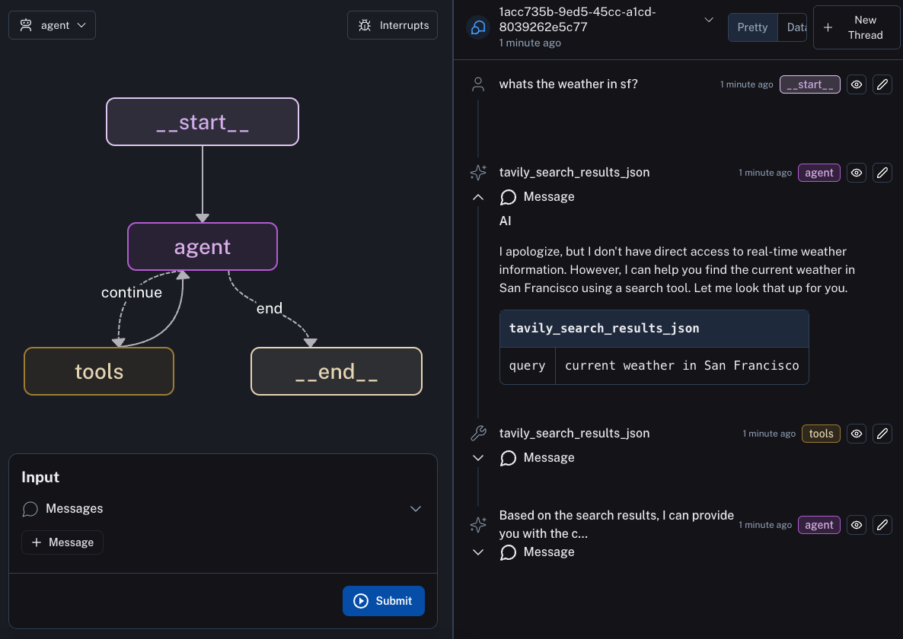

# LangGraph Cloud Example

This is an example agent to deploy with LangGraph Cloud.

> 💡 **Tip:** If you would rather use `requirements.txt` for managing dependencies in your LangGraph Cloud project, please check out [this repository](https://github.com/langchain-ai/langgraph-example).

[LangGraph](https://github.com/langchain-ai/langgraph) is a library for building stateful, multi-actor applications with LLMs. The main use cases for LangGraph are conversational agents, and long-running, multi-step LLM applications or any LLM application that would benefit from built-in support for persistent checkpoints, cycles and human-in-the-loop interactions (ie. LLM and human collaboration).

LangGraph shortens the time-to-market for developers using LangGraph, with a one-liner command to start a production-ready HTTP microservice for your LangGraph applications, with built-in persistence. This lets you focus on the logic of your LangGraph graph, and leave the scaling and API design to us. The API is inspired by the OpenAI assistants API, and is designed to fit in alongside your existing services.

In order to deploy this agent to LangGraph Cloud you will want to first fork this repo. After that, you can follow the instructions [here](https://langchain-ai.github.io/langgraph/cloud/) to deploy to LangGraph Cloud.

# Create User
aws cognito-idp admin-create-user \                                                     
  --user-pool-id us-east-1_F4H8i0qFX \                           
  --username darthShana@gmail.com \                                                                                              
  --user-attributes Name=email,Value=darthShana@gmail.com Name=phone_number,Value=+1234567890 \
  --temporary-password MyTemp123! \
  --message-action SUPPRESS   

# Add property
aws dynamodb put-item \
    --table-name Users \
    --item "$(cat <<EOF
{
    "UserID": {"S": "2564cde7-1570-4e35-bb44-ea34d535345d"},
    "UserEmail": {"S": "Ronakkhatri@gmail.com"},
    "FirstName": {"S": "Ronak"},
    "LastName": {"S": "Khatri"},
    "properties": {"L": [
        {
            "M": {
                "property_id": {"S": "06cca751-a7cb-486e-aa29-c3138ae2a7bc"},
                "address1": {"S": "27 Karoro Road,"},
                "suburb": {"S": "Flat Bush"},
                "city": {"S": "Auckland"},
                "property_type": {"S": "House"},
                "bedrooms": {"N": "3"},
                "assets": {"L": []}
            }
        }
    ]}
}
EOF
)"

aws cognito-idp admin-create-user --user-pool-id us-east-1_F4H8i0qFX --username Ronakkhatri@gmail.com --user-attributes Name=email,Value=Ronakkhatri@gmail.com Name=phone_number,Value=+1234567890 --temporary-password MyTemp123! --message-action SUPPRESS 
s5CAKgE_-'W#Gr.{/SVY}(
